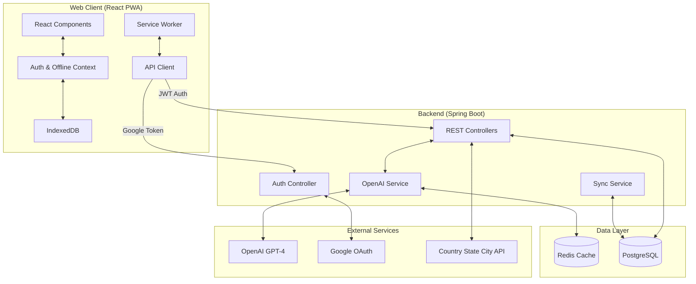
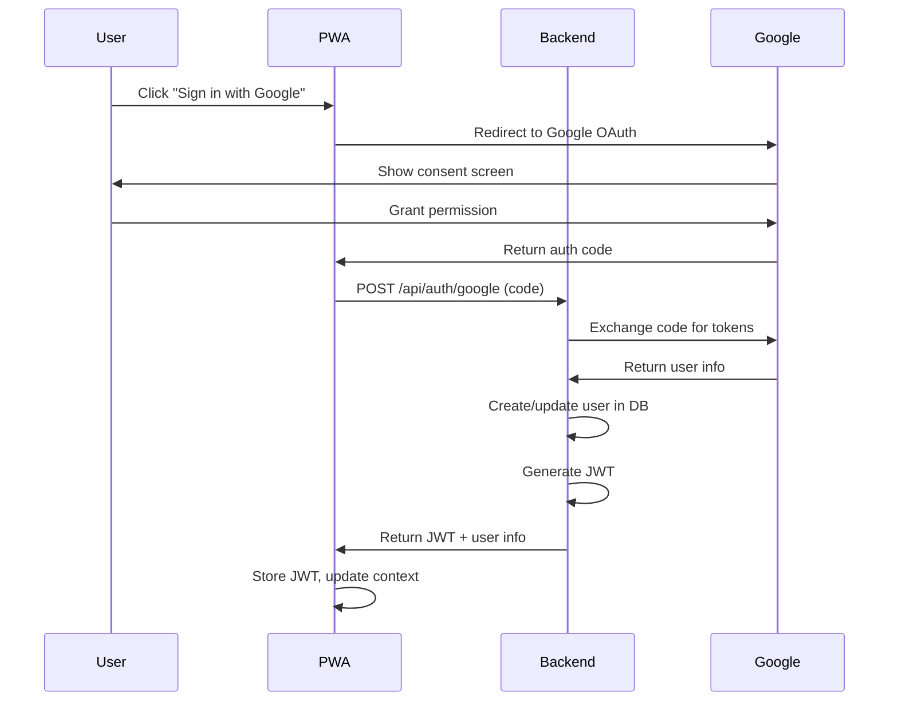
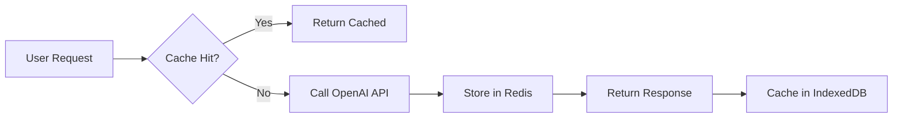
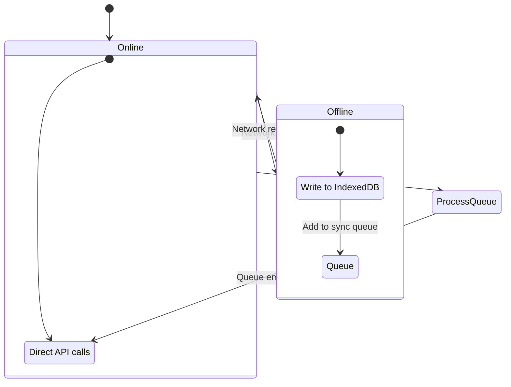
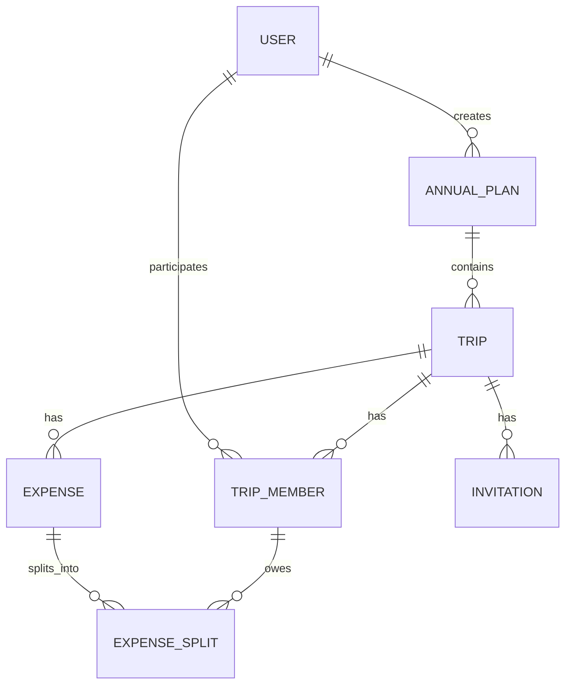
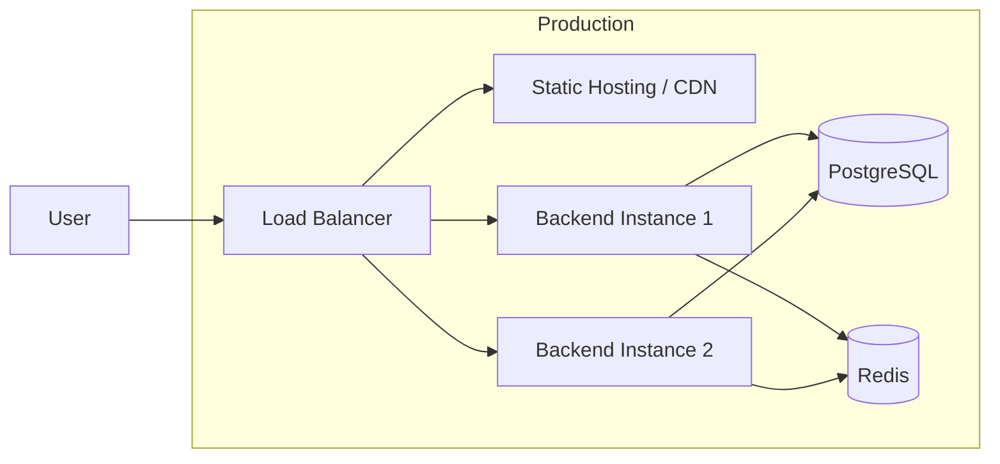

# MicroItinerary Architecture

## Overview

MicroItinerary is an AI-powered Progressive Web Application (PWA) for planning annual travel itineraries. It features intelligent destination suggestions, cost estimation, and collaborative expense management with Splitwise-style splitting.

## High-Level Architecture

The system follows a Client-Server architecture with an "Offline-First" approach. The React PWA serves as the primary interface, with IndexedDB for offline data storage and a service worker for caching.



## Technology Stack

### Web Client (React PWA)
- **Framework**: React 18 + Vite
- **State Management**: React Context
- **Local Storage**: IndexedDB (Dexie.js)
- **HTTP Client**: Axios
- **PWA**: Service Worker + Web App Manifest
- **Styling**: CSS with modern design patterns

### Backend Server
- **Framework**: Spring Boot 3.2.2
- **Language**: Java 21
- **Database**: PostgreSQL 16
- **Caching**: Redis (AI responses)
- **Persistence**: Spring Data JPA
- **Migrations**: Flyway
- **Authentication**: Spring Security + OAuth2 + JWT
- **API Documentation**: SpringDoc OpenAPI (Swagger UI)

### External APIs
- **OpenAI GPT-4**: Destination suggestions, cost estimation
- **Country State City API**: Location data (countries, states, cities)
- **REST Countries API**: Country metadata (flags, currencies)
- **Google OAuth**: User authentication

## Key Components

### 1. Authentication Flow


### 2. AI Integration


**Cache Strategy**:
- Redis: Server-side cache (24 hours TTL)
- IndexedDB: Client-side cache (for offline access)

### 3. Offline Sync


### 4. Expense Splitting Algorithm
```
For each expense:
  1. Get total amount and participants
  2. If equal split: amount / participants.length
  3. If custom split: use provided amounts
  4. Record who paid and who owes

Settlement calculation:
  1. Sum all expenses per person (paid - owed)
  2. Positive = owed money, Negative = owes money
  3. Generate settlement transactions (greedy algorithm)
```

## Database Schema



## API Endpoints

### Authentication
- `POST /api/auth/google` - Google OAuth callback
- `POST /api/auth/refresh` - Refresh JWT
- `POST /api/auth/logout` - Logout

### Annual Plans
- `GET /api/plans` - List user's plans
- `POST /api/plans` - Create plan
- `GET /api/plans/{id}/calendar` - 12-month view

### Trips
- `POST /api/trips` - Create trip
- `GET /api/trips/{id}` - Get trip
- `PUT /api/trips/{id}` - Update trip
- `DELETE /api/trips/{id}` - Delete trip
- `POST /api/trips/{id}/invite` - Invite member

### Expenses
- `POST /api/trips/{tripId}/expenses` - Add expense
- `GET /api/trips/{tripId}/expenses/summary` - Split summary
- `POST /api/expenses/{id}/settle` - Mark settled

### AI
- `POST /api/ai/suggest-destinations` - Get AI suggestions
- `POST /api/ai/estimate-cost` - Get cost estimates

## Security

- **Authentication**: Google OAuth 2.0
- **Authorization**: JWT tokens (24h expiry)
- **API Protection**: All endpoints require valid JWT
- **Secrets**: Environment variables, not in code
- **CORS**: Configured for frontend origin only

## Deployment



### Docker Compose (Development)
- PostgreSQL 16
- Redis 7
- Backend (Spring Boot)
- Frontend (Vite dev server)
