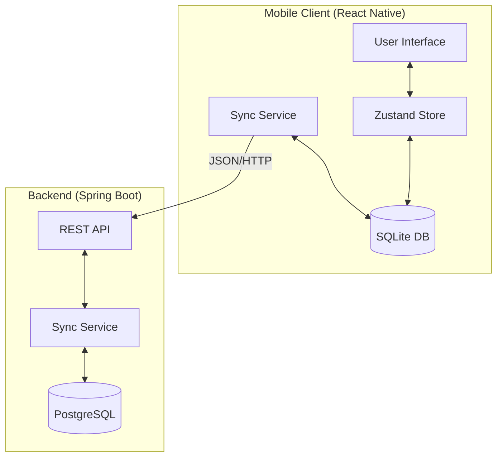

# MicroItinerary Architecture

## Overview
MicroItinerary is an offline-first mobile application designed for planning detailed travel itineraries. It allows users to manage trips, daily activities, and packing lists, with seamless synchronization between local storage and a central server.

## High-Level Architecture

The system follows a Client-Server architecture with an "Offline-First" approach. The mobile client acts as the primary source of truth for the user interface, reading and writing to a local SQLite database. A background synchronization service ensures data consistency with the central backend server.

## Technology Stack

### Mobile Client
- **Framework:** React Native (Expo SDK 52)
- **Language:** TypeScript
- **State Management:** Zustand
- **Local Database:** SQLite (`expo-sqlite`)
- **Navigation:** Expo Router
- **Networking:** Axios
- **UI Components:** React Native standard components
- **Platform Support:** Android, iOS, Web

### Backend Server
- **Framework:** Spring Boot 3.2.2
- **Language:** Java 21
- **Database:** PostgreSQL 16
- **Persistence:** Spring Data JPA
- **Migrations:** Flyway
- **API Documentation:** SpringDoc OpenAPI (Swagger UI)
- **Containerization:** Docker

## Key Components

### 1. Data Synchronization
The application uses a **Last-Write-Wins** strategy with a sync queue.
- **Local Changes:** Operations (CREATE, UPDATE, DELETE) are performed immediately on the local SQLite database and queued for sync.
- **Sync Process:**
    1.  Push local changes to the server.
    2.  Pull remote changes from the server (based on a `lastSyncTimestamp`).
    3.  Resolve conflicts (Server timestamp usually wins or merges).

### 2. Database Schema
#### PostgreSQL (Server)
- Relational schema with tables for `trips`, `activities`, `packing_items`, etc.
- Managed via Flyway migrations.

#### SQLite (Client)
- Mirrors the core server schema but optimized for mobile query patterns.
- Includes `sync_queue` table to track pending changes.

### 3. Deployment
- **Docker Compose:** Orchestrates the Backend and PostgreSQL services for development and easy API testing.
- **Expo:** Handles building and serving the mobile application bundle.
